#  TDE Kicker Menu Classic-X (Standalone Applet)

A modern, high-performance redesign of the Trinity Desktop Environment (TDE) Classic Menu (KMenu), built as a **standalone Kicker panel applet plugin** (`classicxapplet.so`).

Classic-X combines the lightning-fast responsiveness of classic TDE Kmenu with modern UX features: **Windows 10-style instant search filtering**, **typo-tolerant fuzzy suggestions**, **an interactive quick-access sidebar**, **extensive visual theming (custom banners, 3-part header pictures, dynamic text overlays)**, and **23 built-in preset profiles**.

---

## Table of Contents
1. [Key Features Overview](#key-features-overview)
2. [Interactive Navigation & Search Guide (Keyboard & Mouse UX)](#interactive-navigation--search-guide-keyboard--mouse-ux)
3. [Settings & Customization Reference](#settings--customization-reference)
   - [Built-in & User Profiles](#1-built-in--user-profiles)
   - [General Settings, Layout, Centering & Animation](#2-general-settings-layout-centering--animation)
   - [Colors, Transparency & Typography](#3-colors-transparency--typography)
   - [Interactive Sidebar, User Picture & Power Management](#4-interactive-sidebar-user-picture--power-management)
   - [Start Icon, User Avatar & UI Icon Suites](#5-start-icon-user-avatar--ui-icon-suites)
   - [Sidebar Picture & Tiled Pattern Themes](#6-sidebar-picture--tiled-pattern-themes)
   - [Top Header Picture, Alignment & Dynamic Text Overlay](#7-top-header-picture-alignment--dynamic-text-overlay)
4. [Build, Packaging & Installation](#build-packaging--installation)
5. [Technical Architecture & Low-Level C++ Optimizations](#technical-architecture--low-level-c-optimizations)
6. [Screenshots](#screenshots)

---

## Key Features Overview

* **Instant Type-to-Search**: Start typing any alphanumeric key as soon as the menu opens to immediately enter search mode — no dedicated search bar click required.
* **Smart Fuzzy Search & Accent Normalization**: Handles typos, omissions, and transpositions via an L1-cache optimized Damerau-Levenshtein engine. Automatically normalizes multilingual diacritics (`é`, `è`, `ê`, `à`, `î`, `ö`, `ç` $\rightarrow$ `e`, `a`, `i`, `o`, `c`).
* **Recent-Prioritized Ranking**: Search results matching applications in your recent launch history (`kickerrc`) are automatically promoted to top positions.
* **Horizontal Centered Menu Mode**: Option to open and anchor the menu popup centered horizontally relative to the panel button / screen edge, providing a sleek modern dock-style presentation.
* **Customizable Minimum Menu Width**: Set an optional minimum width in pixels (e.g. 500px to 900px) ensuring a spacious, comfortable layout across all screen resolutions and wide banner themes.
* **Smooth Opening Animation**: Optional tear-free sliding window animation calculated dynamically relative to panel orientation and screen edges.
* **Modern Quick-Access Sidebar**: Dedicated interactive buttons for **User / Session**, **Documents**, **Pictures**, **Downloads**, **Settings**, and **Log Out** with optional hover-triggered submenus.
* **Harmonious Menu Separators**: Subtle separator lines automatically blended (35% Foreground + 65% Background) for natural contrast across dark, light, and custom themes with zero runtime overhead.
* **User Picture with Live Preview**: Support for native TDE user avatar (`~/.face`), 18 embedded pixel portraits, or custom images, featuring live preview, color inversion, and color tinting.
* **Expanded Start & UI Icon Suites**: Broad collection of embedded start icons (*WinBlack, Classic, Modern, Tux, Debian, Commodore, Atari, Apple, Q4OS...*) plus 2 new full UI icon theme suites (*ui_alt*, *ui_alt2*, including dedicated Downloads chrome icons).
* **Dynamic 3-Part Header Banner & Multi-Element Text Overlay**: 3-part header images (Left/Center/Right) with customizable themes, color filters (Invert/Colorize), flexible horizontal text alignment (**Center**, **Left**, **Right**), and dynamic overlays: **User Name**, **Custom Text**, **Free RAM (GB)**, **Localized Date**, and **Localized Time (HH:MM)**.
* **23 Built-in Preset Profiles**: Instant visual transformations (e.g. *2001*, *A520ST*, *AlienX*, *BlackMac*, *C64*, *Centered*, *CenteredBlack*, *DebianDevil*, *Doomed*, *Dream*, *GoldFlower*, *GreenWin*, *Japan*, *Q4OSaqua*, *Q4OSmodern*, *RocketScience*, *System7*, *ThinBlack*, *Trinity*, *WinX*, *WintNT2K*, *Woody*, *X11minimal*) embedded as ultra-compact zero-relocation bytecode (< 3.7 KB memory footprint).
* **Deep "Show in Tree" Navigation**: Right-click any search hit to instantly restore the full application category tree and highlight that specific program inside its folder.
* **Standalone Plugin**: Zero modifications required to the system `kicker` binary or `tdebase` packages.

---

## Interactive Navigation & Search Guide (Keyboard & Mouse UX)

Classic-X provides a fluid, friction-free keyboard and mouse workflow:

```
[Open Menu] ─── (Type letters) ───► [Instant Search Results]
    │                                     │
    │ (ESC / Backspace on empty query)    │ (Enter on single match OR highlighted item)
    ▼                                     ▼
[Full Category Tree]                [Launch Application]
    │
    │ (Right-click item)
    ▼
[Context Menu: Add to Desktop / Add to Panel / Show in Tree]
```

### 1. Type-to-Search & Instant Filtering
* **Immediate Activation**: Simply open the menu (via Super key, panel button, or shortcut) and start typing (e.g., `term`). The menu automatically hides the category tree and displays matching applications in real-time.
* **Single-Match Auto-Launch**: When your query narrows down to a **single exact match**, pressing **Enter** launches it immediately without requiring manual arrow selection.
* **Highlighted Launch**: If multiple results are displayed, use **Up / Down Arrow keys** to highlight a candidate and press **Enter** to launch.

### 2. Seamless Tree Stash & Navigation Keys
* **Backspace Navigation**:
  * While editing a search query, **Backspace** deletes characters normally.  
* **Escape (ESC) Handling**:
  * **First ESC**: Exits search mode, clears the query, and restores the full category tree view.
  * **Second ESC** (or ESC while viewing the category tree): Closes the menu.
* **Left / Right / Down Arrows**: Navigate across submenus, recent applications, and sidebar items seamlessly.

### 3. Smart Fuzzy Search (*Did you mean...*)
* If an exact query yields 0 matches, Classic-X automatically triggers its typo-tolerant suggestion engine.
* A title header displays *"No exact results found. Did you mean:"*.
* Suggestions evaluate prefix distances and Damerau-Levenshtein edit distances (e.g. typing `flz` suggests **FileZilla**; typing `gmp` suggests **GIMP**; typing `calc` suggests **KCalc**).
* Exact Enter auto-launch is safely disabled on fuzzy suggestions to prevent accidental launches.

### 4. Right-Click Context Menu & "Show in Tree"
* Right-clicking any application entry (in the search results, recent apps, or category tree) opens the action context menu:
  * **Add to Desktop**: Places a desktop shortcut icon.
  * **Add to Main Panel**: Adds a quick-launch button to the Kicker panel (automatically disabled if the panel is locked in `kickerrc`).
  * **Show in Tree**: Exits search mode, restores the main hierarchy, and recursively expands the exact submenu folder containing the application, scrolling to and highlighting the target item.

---

## Settings & Customization Reference

Access the settings dialog by right-clicking the applet handle or menu button and selecting **Menu Settings**.

### 1. Built-in & User Profiles
* **Preset Profiles Selector**: Switch between 23 crafted built-in profiles (*2001*, *A520ST*, *AlienX*, *BlackMac*, *C64*, *Centered*, *CenteredBlack*, *DebianDevil*, *Doomed*, *Dream*, *GoldFlower*, *GreenWin*, *Japan*, *Q4OSaqua*, *Q4OSmodern*, *RocketScience*, *System7*, *ThinBlack*, *Trinity*, *WinX*, *WintNT2K*, *Woody*, *X11minimal*).
* **Custom Profiles**: Save your current layout, colors, icons, and picture configuration under a custom name, or delete obsolete user profiles saved in `~/.trinity/share/apps/classicxapplet/profiles/`.

### 2. General Settings, Layout, Centering & Animation
* **Center Menu Horizontally**: Center the popup window horizontally along the bottom panel/screen edge relative to the Start button instead of corner-docking.
* **Menu Minimum Width**: Set an explicit minimum width in pixels (e.g. 500px, 700px, 850px) to guarantee a wide, balanced layout across high-resolution displays.
* **Smooth Menu Opening Animation**: Enable fluid, tear-free window sliding animation when the menu opens, automatically adapting to top, bottom, left, or right panel positions.
* **Always Show Search Bar**: Choose between a permanently visible search input field (on-demand type-to-search is always activated independently of this choice).
* **Menu Entry Format**: Choose how applications are named across the menu:
  * *Name only* (e.g., `Konqueror`)
  * *Description only* (e.g., `Web Browser`)
  * *Name (Description)* (e.g., `Konqueror (Web Browser)`)
  * *Description (Name)* (e.g., `Web Browser (Konqueror)`)
* **Tree Icon Size**: Select application icon rendering size (Small `16×16`, Classic `20×20`, `22×22`, `24×24`, `32×32`).
* **Search & Recent Limits**:
  * *Max search results*: 4 to 20 visible items.
  * *Max recent documents*: 5 to 30 items.
* **Application History Mode** (*Mutually Exclusive*):
  * **Display recently used applications**: Shows the most recently launched apps at the top of the menu + Item count spinbox (2 to 6 items).
  * **Display most used applications**: Shows the most frequently launched apps based on historical launch counts + Item count spinbox (2 to 6 items).
  * **Disabled**: Completely removes the top history section.
* **Standard TDE Menu Toggles**: Individually show/hide Trinity Control Center, Run Command, Bookmarks, Print System, Quick-Browser, Network Folders, System Menu, Recent Documents, Special User Menu, and Special Shutdown Menu.

### 3. Colors, Transparency & Typography
* **Transparency Slider**: Adjust menu background opacity from 0% (opaque) to 80% transparency.
* **Color Modes**:
  * *System Default*: Default color theme
  * *TDE*: Follows active TDE widget color scheme
  * *Custom Colors*: Independent color pickers with real-time swatch preview for:
    * **Background Color**
    * **Sidebar Background Color**
    * **Text Area Background Color**
    * **Title Banner Foreground & Background Colors**
    * **Search Text Input Color**
    * **Button Hover Highlight Color**
* **Harmonious Tree Separators**: Automatically blends 35% Foreground + 65% Background for clean, non-intrusive section dividers in the category tree.
* **Font Mode**: Use standard TDE System font (`TDEGlobalSettings::generalFont()`) or select a custom typography font and size via font dialog.

### 4. Interactive Sidebar, User Picture & Power Management
* **Sidebar Toggle & Geometry**: Enable/disable sidebar, configure custom width (24px to 64px), and choose vertical button alignment (*Top*, *Center*, *Bottom*).
* **User Button Position**: Place the User profile button at the **Top** or **Bottom** of the sidebar.
* **Hover Activation**: Submenus (User / Shutdown) can open automatically on pointer hover with configurable delay (100ms to 1000ms).
* **Quick-Access Buttons**: Toggle individual sidebar buttons for **User Menu**, **Shutdown Menu**, **Settings**, **Documents**, **Pictures**, and **Downloads**.
* **Submenu Height Mode**: Choose between **Full Menu Height** (submenus expand to match main menu height perfectly, adapting seamlessly when Top Pictures are active) or **Custom Height** (150px to 600px).
* **Power Management Actions**: Toggle individual power actions (**Power Off**, **Reboot**, **Suspend**, **Hybrid Suspend**, **Hibernate**) with automatic backend detection (ConsoleKit, systemd-logind, UPower, TDE PowerManager).

### 5. Start Icon, User Avatar & UI Icon Suites
* **Start Menu Button**:
  * *Source*: Embedded presets (*Classic, Modern, WinBlack, WinBlue, Tux, Debian, Commodore, Apple, Atari, Q4OS...*), TDE System Icon, or Custom file path.
  * *Live Preview*: Integrated preview widget reflecting icon choice, colorization, color inversion, and exact button proportions.
  * *Rendering*: **Full-scale** (expands icon to fill panel button dimensions with live preview feedback), **Invert colors**, and **Colorize tint** with custom color picker.
* **User Profile Picture**:
  * *Modes*: Disabled, TDE User Avatar (`~/.face`), Embedded preset portraits (18 pixel art and modern avatars), or Custom image path.
  * *Live Preview*: Snug square preview frame with real-time feedback.
  * *Filters*: **Invert colors** and **Colorize tint** with dedicated color picker.
* **UI Icons (Sidebar & Submenu Chrome)**:
  * *Size*: 16px, 22px, 24px, 28px, 32px, 36px, 48px.
  * *Icon Theme Suites*: Choose between Default, TDE System, and 2 complete modern alternative sets (*ui_alt*, *ui_alt2*), including dedicated modern icons for **Downloads**, **Documents**, **Pictures**, **Settings**, **User**, **Shutdown**, **Power Off**, **Reboot**, **Suspend**, **Hibernate**, and **Hybrid Sleep**.
  * *Filters*: **Invert colors** and **Colorize tint**.

### 6. Sidebar Picture & Tiled Pattern Themes
* **Modes**: Disabled, **Pattern mode** (repeating vertical tile), or **Picture mode** (single background graphic).
* **Sources**: Embedded preset themes (*Ocean, Lava, HAL9000, Borders, Carbon, Waves, Retro, Chevron...*) or Custom image file.
* **Layout & Geometry**:
  * *Width Mode*: **Stretch** (proportional scaling to sidebar width) or **Crop** (centered native resolution).
  * *Vertical Alignment*: **Align Top** or **Align Bottom** (in Picture mode).
  * *Extend Edges*: Render behind sidebar button padding for edge-to-edge aesthetics.
* **Filters*: **Invert colors** and **Colorize tint** with custom color selection.

### 7. Top Header Picture, Alignment & Dynamic Text Overlay
* **3-Part Header Banner**: Embed Left / Center (tiled) / Right composite banners (*Royal, Slate, Ocean, Minimal, Classic...*) or custom image files.
* **Banner Filters**: **Invert colors** and **Colorize tint** with custom highlight color.
* **Horizontal Text Alignment**: Align overlay text to **Center**, **Left**, or **Right** inside the header picture banner.
* **Dynamic Multi-Element Text Overlay**:
  * Combine any combination of:
    * **User Name**: Full user name or login name via `KUser`.
    * **Custom Text**: Custom string (e.g. *"Trinity Desktop"*).
    * **Free RAM**: Real-time available system memory formatted in GB (e.g. `RAM: 8.3 GB`).
    * **Date of the day**: Localized date format.
    * **Time (HH:MM)**: Localized hour and minute without distracting seconds.
  * Automatically formatted with clean `" - "` separators.
* **Text Color Modes**: *TDE Default*, *Title Text Color*, or *Custom Color*.

---

## Build, Packaging & Installation

Classic-X can be built and distributed either as a standard Debian package (`.deb`) or as an automated, user-friendly Q4OS installer (`.qsi`).

### Prerequisites
* TDE development headers: `tdebase-trinity-dev`, `tqca-trinity-dev`, `libtqt3-mt-dev`
* Build tools: `cmake` (>= 3.0), `g++`, `make`, `dpkg-deb`, `zlib1g-dev`
* Optional (for `.qsi` installer generation): `q4os-devpack-base`

### Building Packages

#### 1. Debian Package (`.deb`)
Run the debian builder script from the repository root:
```bash
./create_applet_deb.sh [version]
```
This automated script will:
1. Generate `src/applet/classicx_version.h` containing the target version.
2. Run `convert_images.py` (lossless PNG chunk stripping + single zlib stream compression) and `convert_profiles.py` (compact delta binary database).
3. Configure CMake with optimal C++ flags and build `classicxapplet.so`.
4. Strip the binary aggressively (`sstrip` / `strip`).
5. Generate the `.deb` package (`tde-kicker-classicx-applet_<version>_amd64.deb`).

#### 2. Q4OS Self-Extracting Installer (`.qsi`)
To produce an all-in-one wizard installer for Q4OS with embedded graphics, HTML descriptions, and dependency checks:
```bash
./create_applet_qsi.sh [version]
```
This produces `setup_tde-kicker-classicx-applet_<version>.qsi` ready for direct graphical deployment.

### Installation & Activation

#### Method A: Q4OS Graphical Setup (`.qsi`)
* Double-click on `setup_tde-kicker-classicx-applet_<version>.qsi` in the file manager, or run:
  ```bash
  appsetup2.exu setup_tde-kicker-classicx-applet_<version>.qsi
  ```
* Follow the step-by-step wizard to install the applet.

#### Method B: Debian Package (`.deb`)
* Install the generated `.deb` package directly:
  ```bash
  sudo apt install ./tde-kicker-classicx-applet_*_amd64.deb
  ```

#### Method C: Official APT Repository (Automated Updates)
```bash
echo "deb [trusted=yes] https://seb3773.github.io/ClassicX-tde/ stable main" | sudo tee /etc/apt/sources.list.d/classicx.list
sudo apt update
sudo apt install tde-kicker-classicx-applet
```

#### Adding Classic-X to Kicker Panel
1. Restart Kicker to reload plugins (if necessary):
   ```bash
   kicker --replace &
   ```
2. Right-click an empty area of your Kicker panel $\rightarrow$ **Add Applet to Panel...** $\rightarrow$ Select **Classic-X Menu** $\rightarrow$ Click **Add to Panel**.
3. Right-click the Classic-X Start button to open **Classic-X Settings** and select your preferred profile and theme.

---

## Technical Architecture & Low-Level C++ Optimizations

| Component / File | Purpose |
|------------------|---------|
| `src/applet/classicx_applet.cpp` | Applet entry point and Kicker panel button integration |
| `src/applet/k_mnu.cpp` | Main menu class (`PanelKMenu`), search engine, result layout, tree stash / restore, custom separators |
| `src/applet/classicx_settings_dialog.cpp` | Settings dialog (`ClassicXSettingsDialog`) and About dialog |
| `src/applet/classicx_profile.cpp` | Profile management (unified built-in & disk profiles) |
| `src/applet/service_mnu.cpp` | Service menu class (`PanelServiceMenu`), context menu, Show in Tree, `kickerrc` lock check |
| `src/applet/global.cpp` | Shared helpers: color caching, `treeIconPixelSize()`, `menuIconSet()`, search pad icon cache |
| `src/applet/embedded_icons.cpp` | Embedded icon provider with on-demand zlib decompression |
| `src/applet/recentapps.cpp` | History manager (`RecentlyLaunchedApps`), `kickerrc` `RecentAppsStat` reader/writer |
| `src/applet/classicxSettings.kcfg` | Configuration skeleton (`MenuEntryHeight`, `ShowRecentApps`, `NumRecentApps`, `SidebarHoverDelay`, etc.) |
| `convert_images.py` | PNG chunk optimizer and zlib stream generator (`classicx_embedded_icons.h`) |
| `convert_profiles.py` | Generator for zero-relocation binary delta profile database (`classicx_builtin_profiles.h`) |
| `update_apt_repo.sh` | Automated APT repository and GitHub Pages publishing script |
| `create_applet_deb.sh` | Automated build and packaging script for Debian/TDE (`.deb`) |
| `create_applet_qsi.sh` | Automated build and packaging script for Q4OS (`.qsi`) |
| `qsi_setup/` | Templates, HTML pages, and visuals for the Q4OS graphical wizard |

### Load-Bearing TQt3 Framework Constraints

TQt3 `TQPopupMenu` and `TQIconSet` have specific internal constraints that must be preserved:

1. **One Pixel Size `S` for Tree Application Icons**:
   * Tree/search application icons use `KickerLib::treeIconPixelSize()`.
   * `UiIconSize` is reserved for sidebar/chrome only. `menuIconSet()` scales icons to exact $S \times S$ dimensions and publishes pixmaps across Small and Large modes.
2. **Constant Search Height via Transparent Pads**:
   * Search results allocate `maxSearchResults` rows using real hits + transparent pad items (`treeIconPadIconSet`), followed by `adjustSize()`.
   * TQt3 downscales large pads if not explicitly assigned matching sizes, causing height jitter. Cached pads guarantee identical row height whether 1 or 20 results match.
3. **Tree Stash (Instant Search Exit)**:
   * On first keystroke, tree items are hidden in place (`setItemVisible(false)`), preserving item IDs and submenu instances.
   * Search rows use disjoint ID ranges (`6000+`) to avoid collisions with tree IDs (`4242–5242`).
   * When exiting search (Backspace/ESC), search rows are removed and tree items unhidden in $O(1)$ without rebuilding Sycoca or bookmarks.

### Performance & Memory Optimizations

1. **L1-Cache Compact Damerau-Levenshtein Engine**:
   * DP matrix is compressed from $65 \times 65$ (16.9 KB) to a $3 \times 65$ circular row buffer (780 bytes), remaining 100% inside CPU L1 Data Cache.
   * Prefix edit distances are computed in a single pass directly from row `len1` in $O(1)$ time.
   * **Ukkonen Early Exit**: Halts computation immediately when row minimums exceed the error threshold.
2. **Pre-Tokenized Sycoca Search Index**:
   * App names and descriptions are tokenized during Sycoca build (`buildServiceCache`). Interactive typing operates on constant references (`const TQStringList &`) with zero runtime regex evaluations.
3. **Single-Pass UTF-16 Normalization**:
   * Combines lowercase conversion and diacritics stripping (`toLowerAndUnaccent`) in a single linear pass over raw UTF-16 pointers (`TQChar *`), eliminating heap allocations and copy-on-write detachments.
4. **Contiguous Vector Memory Storage**:
   * `RecentlyLaunchedApps` uses contiguous `TQValueVector` storage instead of node-allocated linked lists, maximizing L1/L2 cache prefetching.
5. **Non-Blocking Display Manager IPC**:
   * Session control (`dmctl.cpp`) uses non-blocking POSIX sockets with `fcntl(O_NONBLOCK)` and bounded `poll()` timeouts (~2000ms), preventing UI lockups if display daemons freeze.
6. **Zero-Relocation Delta Built-in Profiles Architecture**:
   * In 64-bit shared modules (`.so`), static struct arrays with string pointers generate hundreds of 24-byte dynamic relocations (`.rela.dyn`). Classic-X encodes all 23 built-in profiles as a contiguous byte stream (`s_profileDeltaBlob[]`), eliminating 100% of relocation overhead.
   * A 150-byte baseline defines defaults; each profile encodes only differential keys (3-byte RGB colors, 1-2 byte scalars, inline UTF-8).
   * Inactive options are pruned during build, keeping the entire 23-profile database under **3.7 KB in memory**.
7. **Single-Stream Zlib Asset Pipeline with Chunk Stripping**:
   * 172 embedded PNG assets are processed by `convert_images.py` to strip non-critical metadata chunks (`tEXt`, `iCCP`, `pHYs`, `bKGD`, `sRGB`).
   * All assets are concatenated and compressed into a single zlib Deflate stream (Level 9), reducing raw embedded asset size to **~81.5 KB** in `.rodata`.
   * Lazy decompression decompresses the single block in **~0.2 ms** upon first access, caching the pointer for instant random access by all UI components without per-icon decode overhead.
8. **Polymorphic Menu Separators & Harmonious Color Blending**:
   * Overcomes TQt3's non-virtual `TQPopupMenu::drawItem` constraint by implementing `ClassicXMenuSeparator` via `TQCustomMenuItem` whose `virtual void paint(...)` is invoked polymorphically by the Qt rendering engine.
   * The separator color is precalculated at palette load ($35\% \times \text{Foreground} + 65\% \times \text{Background}$) and cached in `s_cachedSeparatorColor` in `global.cpp`, guaranteeing zero arithmetic cost during painting.
9. **Selective Granular `-Os` Compilation**:
   * The settings dialog (`classicx_settings_dialog.cpp`) and profile loader (`classicx_profile.cpp`) are compiled with `-Os` (`#pragma GCC optimize ("Os")` + CMake `COMPILE_FLAGS "-Os"`), reducing binary size by ~16 KB while keeping core search and indexing engines at `-O2 -flto=auto` performance.
10. **Tear-Free Menu Opening Animation Engine**:
    * When `AnimateOpening` is enabled, the menu uses an interpolation state machine driven by a low-overhead timer loop (`animateStep()`) operating across a ~90ms envelope.
    * Geometric steps calculate window position and height/width expansion incrementally relative to panel edge orientation (Bottom, Top, Left, Right).
    * Geometry is clamped to single-buffer target bounds without secondary resize events or multiple repaint cycles, preventing X11 compositor tearing, artifacts, and input stalling.
11. **Sub-Microsecond Free RAM Kernel Probe**:
    * System memory availability for the dynamic top header overlay is extracted via direct linear reading of `/proc/meminfo` (`MemAvailable` / `MemFree`) using native POSIX system calls (`open(..., O_RDONLY)` / `read()` / `close()`).
    * Takes **~2 microseconds** ($0.000002$s), eliminating shell forks, helper subprocesses (`free`, `awk`, `vmstat`), and background polling daemons.

---

## Screenshots

| | | |
| :---: | :---: | :---: |
| <a href="screenshots/ksnapshotEntCrj.png">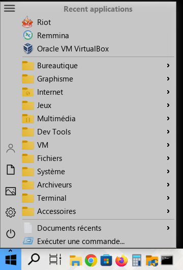</a> | <a href="screenshots/ksnapshotw7NiVO.png">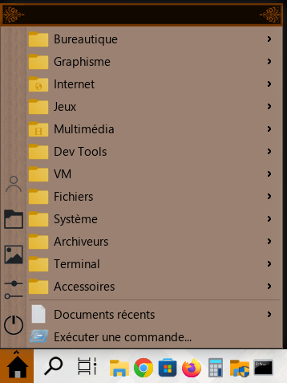</a> | <a href="screenshots/ksnapshot43I6hS.png">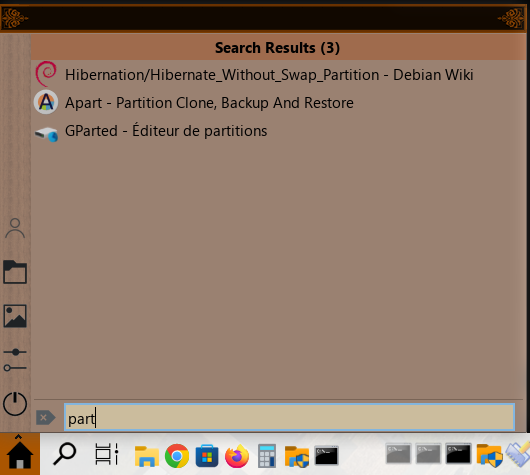</a> |
| <a href="screenshots/ksnapshotR4BuuU.png">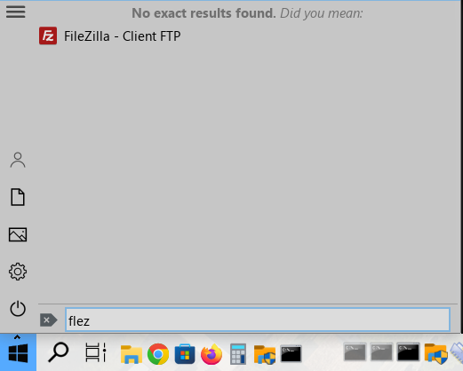</a> | <a href="screenshots/ksnapshotOXWlfJ.png">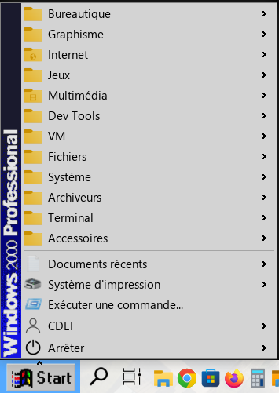</a> | <a href="screenshots/ksnapshotbOUzrD.png">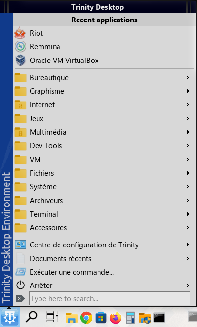</a> |
| <a href="screenshots/ksnapshotTdZxt6.png">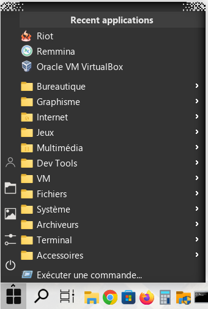</a> | <a href="screenshots/ksnapshot7cSo16.png">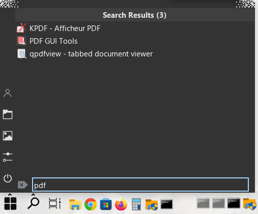</a> | <a href="screenshots/ksnapshotUzi77S.png">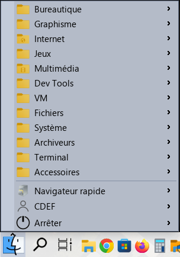</a> |
| <a href="screenshots/ksnapshotMgXKS8.png">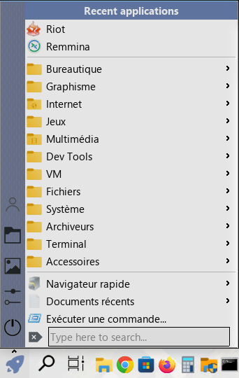</a> | <a href="screenshots/ksnapshotwehOuH.png">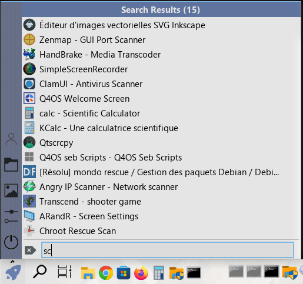</a> | <a href="screenshots/ksnapshotnPwtWT.png">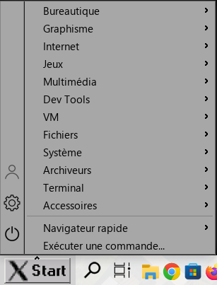</a> |
| <a href="screenshots/ksnapshotN5Ob9R.png">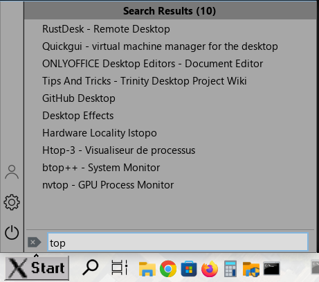</a> | <a href="screenshots/ksnapshotd651yo.png">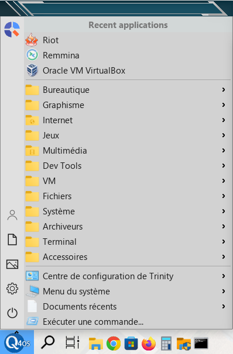</a> | <a href="screenshots/ksnapshotEMwanS.png">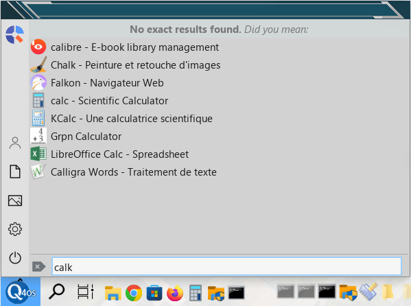</a> |
| <a href="screenshots/ksnapshotYt0tkW.png">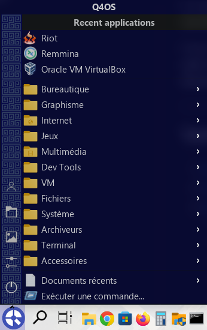</a> | <a href="screenshots/ksnapshotHuatNE.png">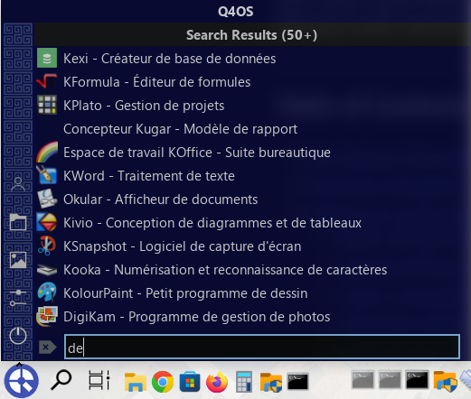</a> | <a href="screenshots/ksnapshotqOJTWi.png">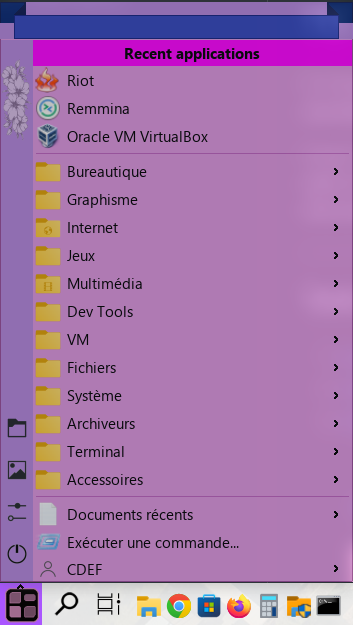</a> |
| <a href="screenshots/ksnapshotsVjjB2.png">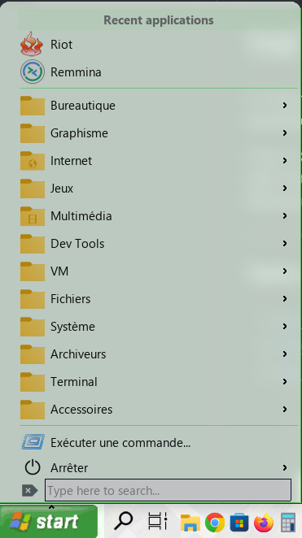</a> | <a href="screenshots/ksnapshotKd1Ksi.png">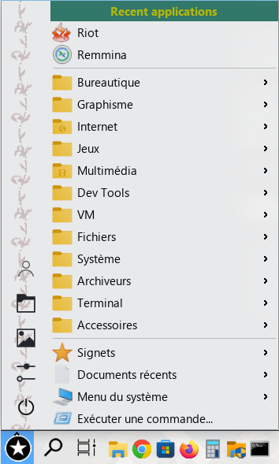</a> | <a href="screenshots/ksnapshotfM3B4x.png">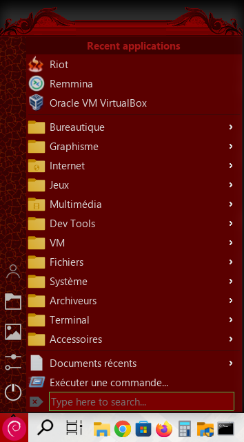</a> |
| <a href="screenshots/ksnapshotQfdrxg.png">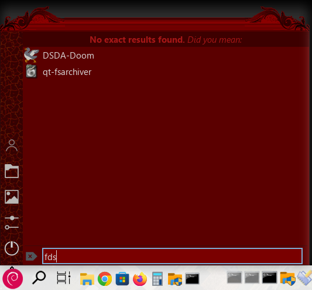</a> | <a href="screenshots/ksnapshotX0R94R.png">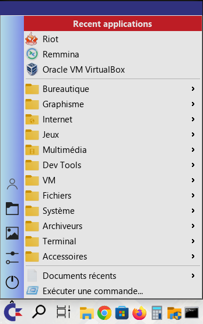</a> | <a href="screenshots/ksnapshotMhKNVC.png">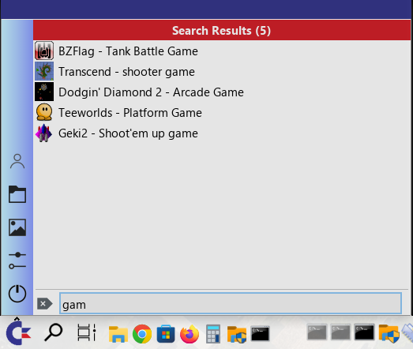</a> |
| <a href="screenshots/ksnapshotyHXt4A.png">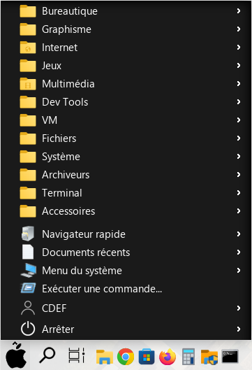</a> | <a href="screenshots/ksnapshotXnmddV.png">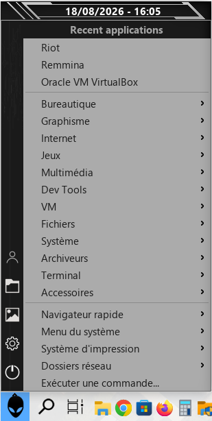</a> | <a href="screenshots/ksnapshotsO4OUQ.png">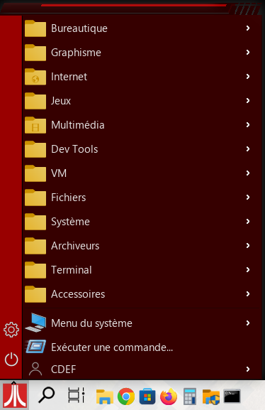</a> |
| <a href="screenshots/settings_panel.jpg">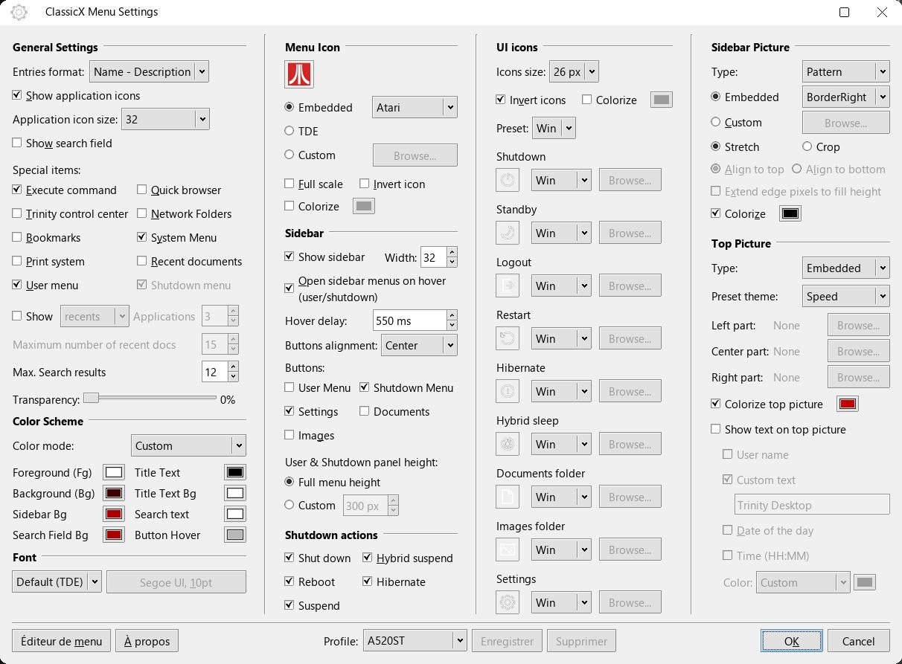</a> | <a href="screenshots/start_menu_embedded.jpg">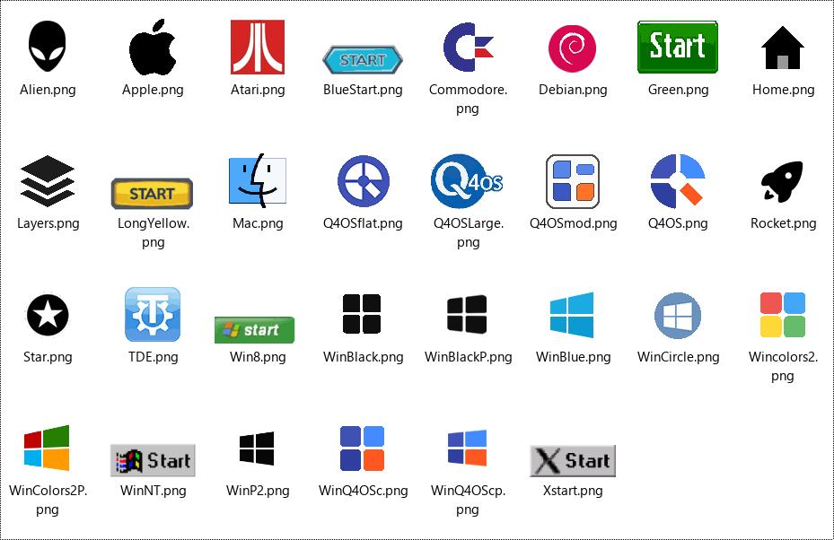</a> |   |
